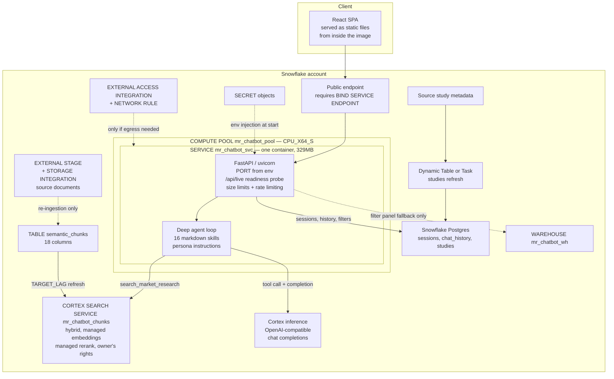

```mermaid
flowchart TB
  subgraph client["Client"]
    UI["React SPA<br/>served as static files<br/>from inside the image"]
  end

  subgraph acct["Snowflake account"]
    ING["Public endpoint<br/>requires BIND SERVICE ENDPOINT"]

    subgraph pool["COMPUTE POOL mr_chatbot_pool — CPU_X64_S"]
      subgraph svc["SERVICE mr_chatbot_svc — one container, 329MB"]
        API["FastAPI / uvicorn<br/>PORT from env<br/>/api/live readiness probe<br/>size limits + rate limiting"]
        AGENT["Deep agent loop<br/>16 markdown skills<br/>persona instructions"]
        API --> AGENT
      end
    end

    CS["CORTEX SEARCH SERVICE mr_chatbot_chunks<br/>hybrid, managed embeddings<br/>managed rerank, owner's rights"]
    CHUNKS["TABLE semantic_chunks<br/>18 columns"]
    CORTEX["Cortex inference<br/>OpenAI-compatible<br/>chat completions"]
    PG["Snowflake Postgres<br/>sessions, chat_history, studies"]
    WH["WAREHOUSE mr_chatbot_wh"]
    SRC["Source study metadata"]
    DT["Dynamic Table or Task<br/>studies refresh"]
    STAGE["EXTERNAL STAGE<br/>+ STORAGE INTEGRATION<br/>source documents"]
    SEC["SECRET objects"]
    EAI["EXTERNAL ACCESS INTEGRATION<br/>+ NETWORK RULE"]
  end

  UI --> ING
  ING --> API
  AGENT -->|"tool call + completion"| CORTEX
  AGENT -->|"search_market_research"| CS
  CHUNKS -->|"TARGET_LAG refresh"| CS
  API -->|"sessions, history, filters"| PG
  API -.->|"filter panel fallback only"| WH
  SRC --> DT --> PG
  STAGE -.->|"re-ingestion only"| CHUNKS
  SEC -.->|"env injection at start"| API
  EAI -.->|"only if egress needed"| svc
```
