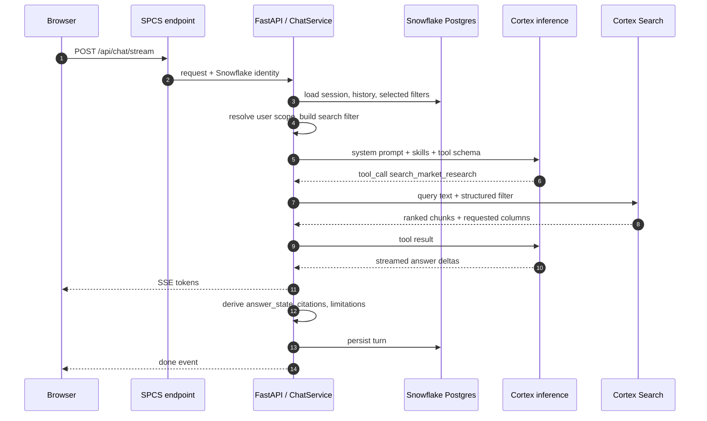

```mermaid
sequenceDiagram
  autonumber
  participant U as Browser
  participant E as SPCS endpoint
  participant A as FastAPI / ChatService
  participant P as Snowflake Postgres
  participant M as Cortex inference
  participant S as Cortex Search

  U->>E: POST /api/chat/stream
  E->>A: request + Snowflake identity
  A->>P: load session, history, selected filters
  A->>A: resolve user scope, build search filter
  A->>M: system prompt + skills + tool schema
  M-->>A: tool_call search_market_research
  A->>S: query text + structured filter
  S-->>A: ranked chunks + requested columns
  A->>M: tool result
  M-->>A: streamed answer deltas
  A-->>U: SSE tokens
  A->>A: derive answer_state, citations, limitations
  A->>P: persist turn
  A-->>U: done event
```
